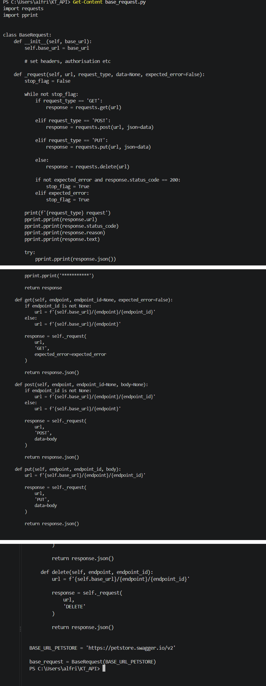
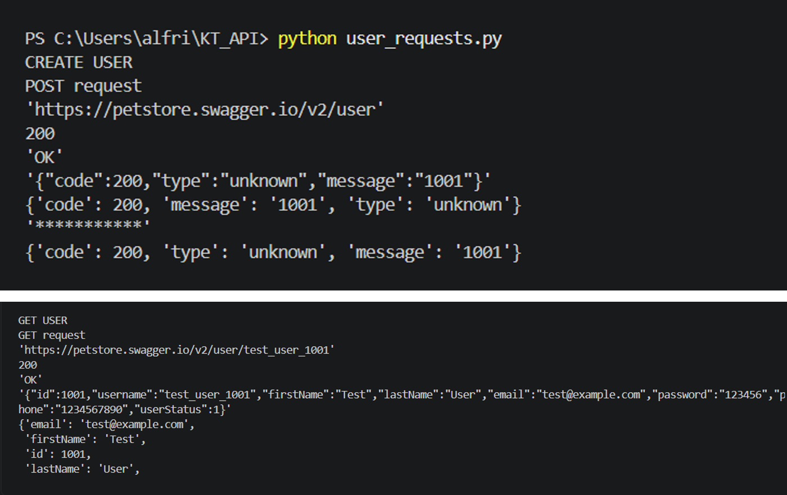
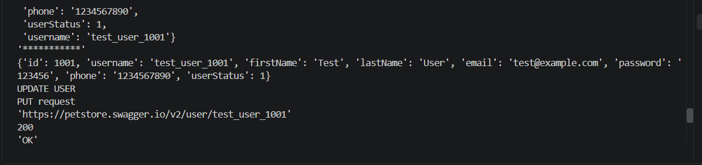
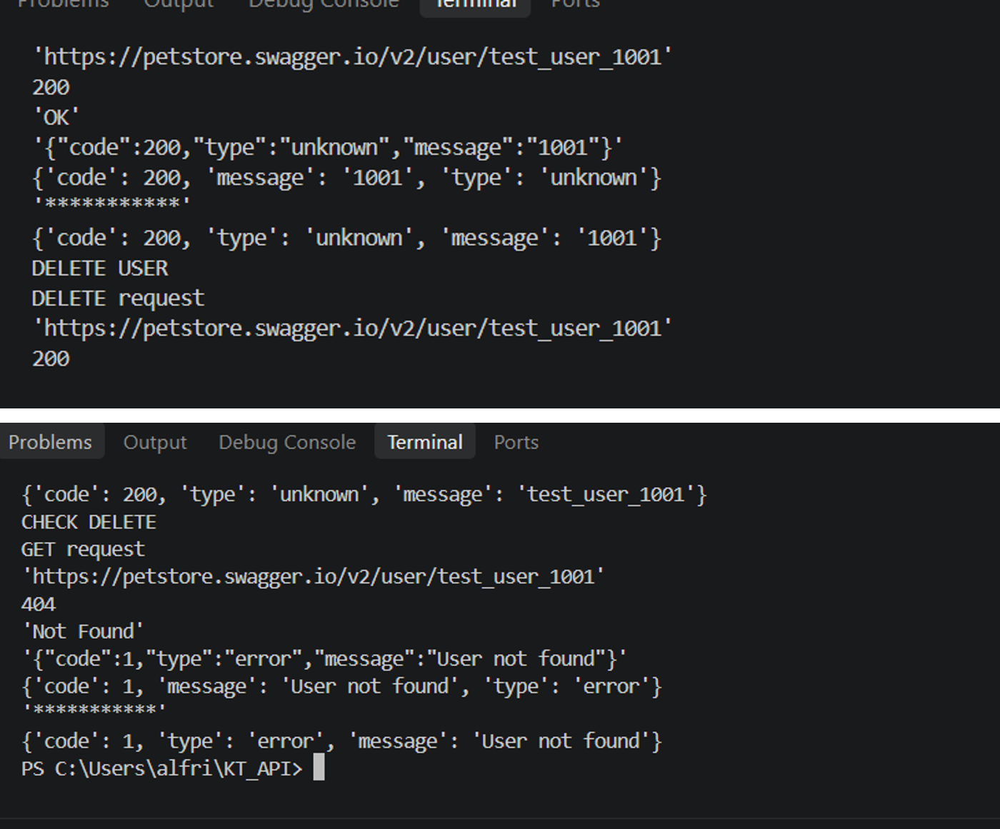
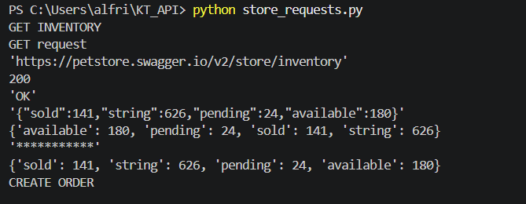
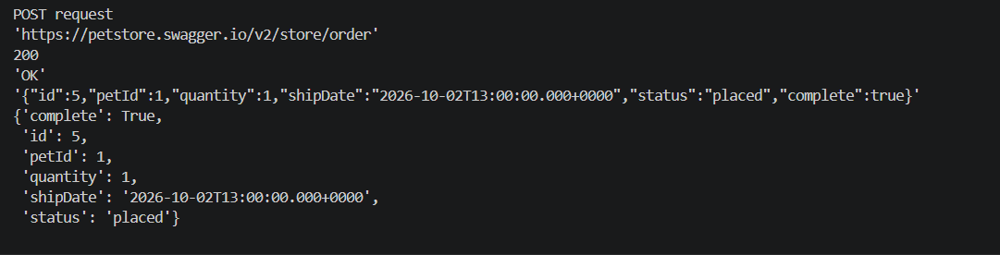
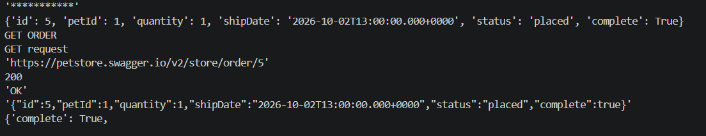
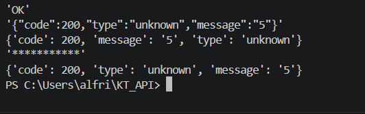

# КТ — API Testing

## Цель

Протестировать API Swagger Petstore с помощью Python, используя базовый класс `BaseRequest` из примера `api_testing`.

Swagger Petstore: https://petstore.swagger.io/

Пример: https://github.com/sadboy2001/api_testing

## Структура проекта

```text
KT_API/
├── base_request.py
├── user_requests.py
├── store_requests.py
└── Screenshots/
```

## BaseRequest

В `base_request.py` реализован общий класс для выполнения GET, POST, PUT и DELETE запросов.

Базовый URL:

```text
https://petstore.swagger.io/v2
```



## User

Выполнены 4 запроса:

| Запрос | Endpoint | Результат |
|---|---|---|
| POST | `/user` | 200 OK |
| GET | `/user/test_user_1001` | 200 OK |
| PUT | `/user/test_user_1001` | 200 OK |
| DELETE | `/user/test_user_1001` | 200 OK |

После удаления выполнен GET-запрос. Получен `404 Not Found`, пользователь удалён.

  
  


## Store

Выполнены 4 запроса:

| Запрос | Endpoint | Результат |
|---|---|---|
| GET | `/store/inventory` | 200 OK |
| POST | `/store/order` | 200 OK |
| GET | `/store/order/5` | 200 OK |
| DELETE | `/store/order/5` | 200 OK |

  
  
  


## Соответствие заданию

- Swagger Petstore использован.
- Изучен пример `api_testing`.
- Создан и использован базовый класс `BaseRequest`.
- Реализовано 4 запроса для `user`.
- Реализовано 4 запроса для `store`.
- Результаты запросов проверены. 


